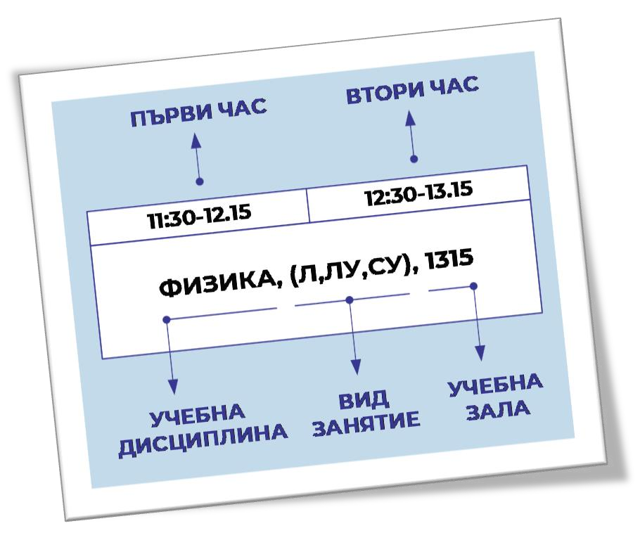
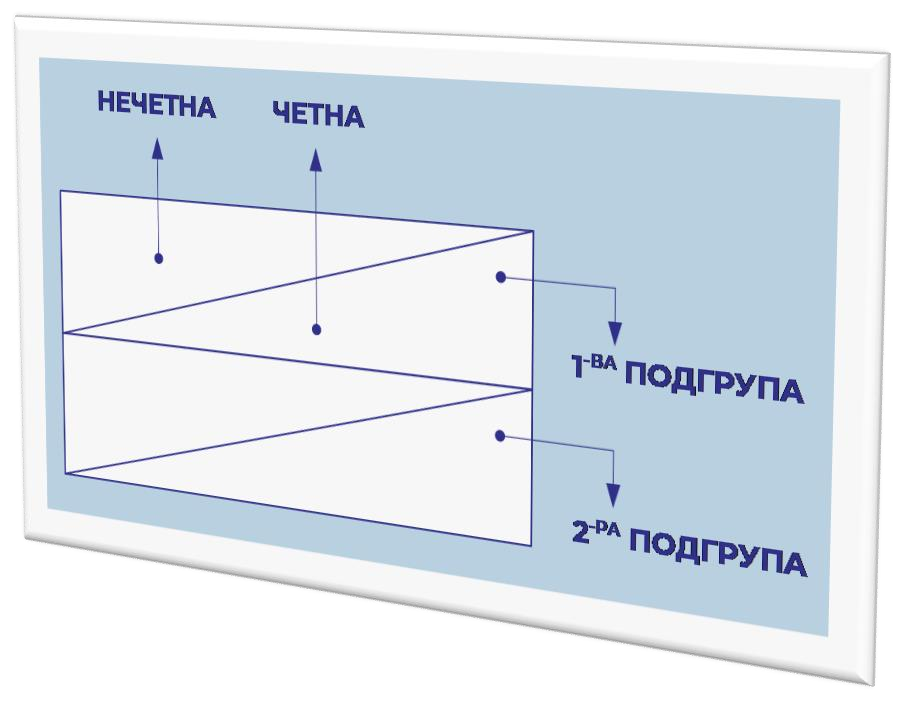
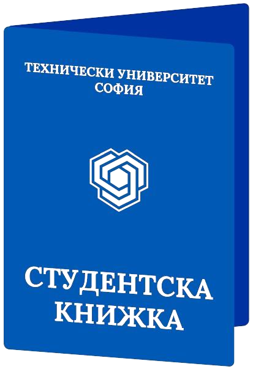
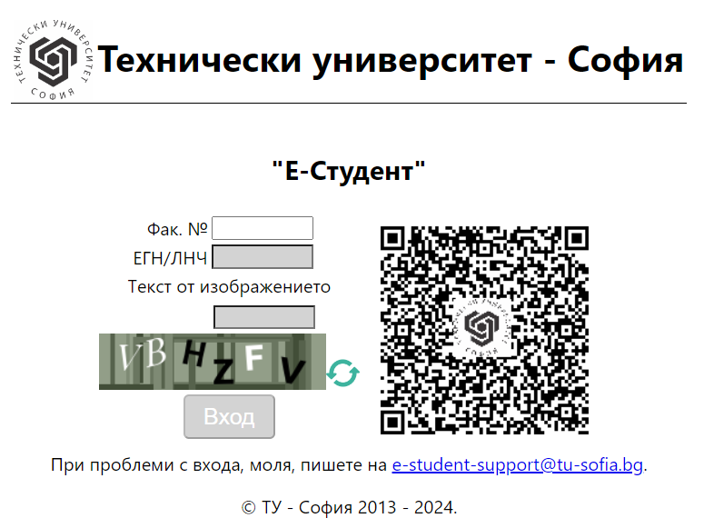
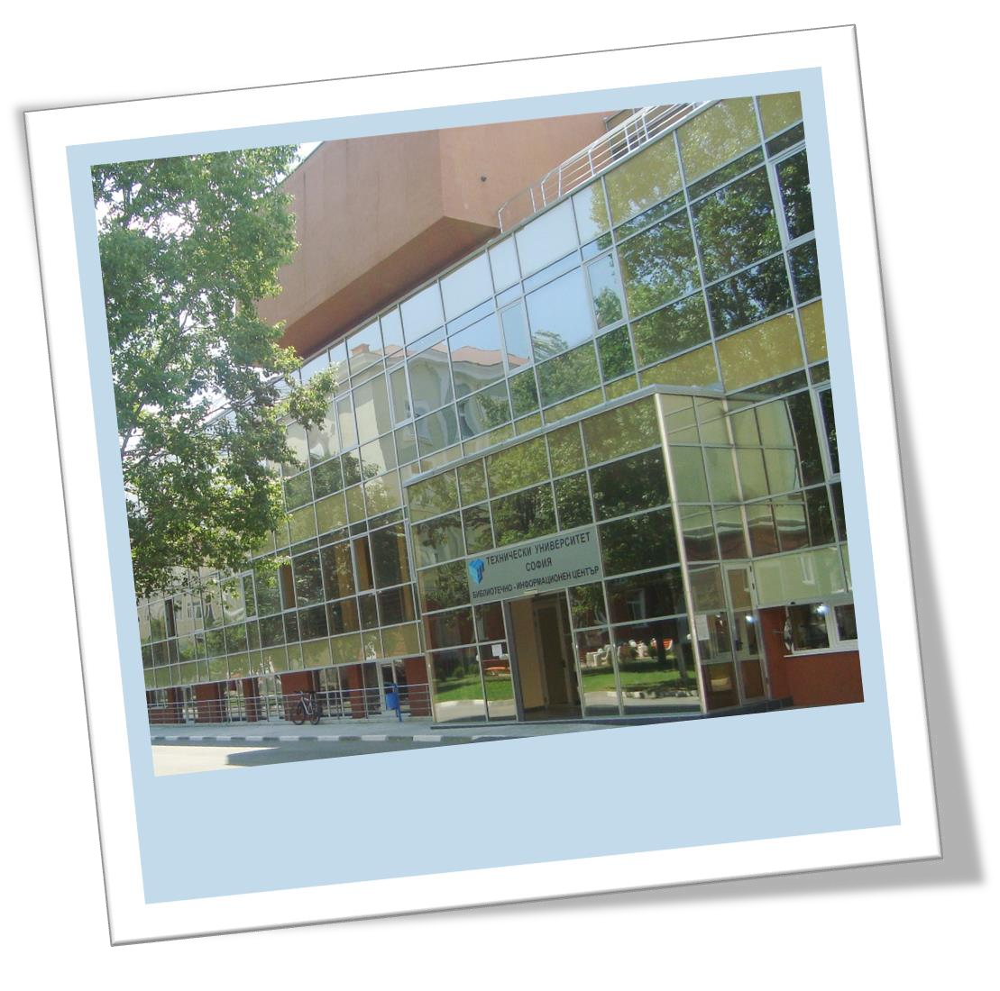

## Номерация на залите в ТУ – София

Първата цифра или първите две цифри (при петцифрен
номер) обозначават номера на учебния блок. Следващата
цифра обозначава етажа, а последните две – номера на за-
лата или лабораторията.

**Например:**

```
1435 – блок 1, етаж 4, зала 35
12607 – блок 12, етаж 6, зала 07
105 – стая на 1 етаж в езиковия център на ТУ
```

## Седмичен разпис (програма)

Седмичният разпис на занятията е валиден за 13-те седмици на съответния семестър (зимен или летен),
които се делят на нечетна (1-ва, 3-та, 5-та, … , 13-та) и четна (2-ра, 4-та, 6-та, … , 12-та) седмица.
Той може да бъде намерен на [сайта на университета](https://tu-sofia.bg/university/weeklyprograms).

За провеждане на упражнения групите се делят на подгрупи, а лекциите по дисциплина са общи за групата
или за няколко групи, които образуват поток. Занятията за съответния номер група са на един ред от разписа,
който се отнася за един поток. Часовите интервали на занятията са отразени в колоните на таблицата - разпис.


**Основните видове занятия са:**

- **ЛУ (лабораторно упражнение)**
- **СУ (семинарно упражнение)**
- **Л (лекция)**


Хоризонтална линия, която разделя клетката, означава, че групата се дели на две подгрупи. Когато линията е по диагонал,
занятието над диагонала се провежда в нечетна седмица, а това под диагонала – в четна.

## Групов отговорник

Груповият отговорник отговаря за координацията в групата и между групата и преподавателите. Може да бъде избран служебно или от студентите в групата.

## Занятия и заверка

**Присъствието на всички занятия (лекции, упражнения и практики) е задължително!** При отсъствие някои от занятията могат да бъдат отработени с друга група,
обикновено след предварителна уговорка с преподавателя. Изпълнението от студента на всички задължения по даден предмет (присъствие, изготвяне на зададените
курсови задачи и проекти и др.) се удостоверява със **заверка**, която се дава от съответния преподавател. За различните видове занятия (лекция, упражнение,
курсов проект, практика) се получава отделна заверка. В края на семестъра заверката се генерира автоматично, при липса на санкция от преподавателя.
Преподавателят **може да откаже заверка**, когато: студентът не е присъствал на повече от **20** на сто от лекциите или на повече от **10** на сто от лабораторните или семинарните упражнения.

❗**Важно! Какво ще стане ако не получиш заверка по някой предмет?**

Студентът, не получил заверка по дадена дисциплина, изпълнява всички необходими задължения по тази дисциплина през следващата учебна година, след което се допуска до изпит.

❗**Още нещо важно**:

Записването на студентите и оформянето на тяхното студентско състояние приключва в 10-дневен срок след началото на семестъра, и до 15 дни след края на летния семестър.
Студентите от ОКС „бакалавър“ могат да се записват в трети или по-горен курс условно с до два невзети изпита. При особени случаи и при подадена молба от студент деканът
може да разреши условно записване с повече невзети изпита.

## Изпити

В рамките на учебната година, в която се изучава дадена дисциплина, имате право да се явите на изпит по тази дисциплина общо до три пъти – по един път на сесия.
Сесиите са три - **редовна, поправителна и ликвидационна**. Ако студентът не се яви, изпитът се счита за неуспешен. След три неуспешни изпита всяко следващо явяване се заплаща.
Студентите се допускат до изпити само ако са получили заверка по съответната дисциплина. Студентите могат да се явяват за коригиране на успеха си максимум по 4 дисциплини,
еднократно в рамките на срока за обучение при условие, че оценката е различна от слаб (2,00). Коригиращата оценка по съответната дисциплина се счита за окончателна.
Графикът на учебния процес, включително и на сесиите за учебната година можете да намерите на електронния адрес на [академичния календар](https://tu-sofia.bg/university/calendar).
Kонкретните дати и залите, в които ще се провеждат изпитите ще намерите на [този адрес](https://tu-sofia.bg/university/exams).

## Информация за началото на семестъра

В рамките на първите две седмици преподавателите предоставят конспект по дисциплината, както и информират за организацията на учебния процес по съответния предмет.
Готовите, подписани от Ректора **студентски книжки** се връчват на студентите при откриването на учебната година. Те могат да се получат и от студентската канцелария на
съответния факултет или от груповия отговорник.



С изключение на първия семестър, за който най-вероятно вече сте платили, семестриалните такси се заплащат в срок до две седмици от началото на семестъра.
Платежният документ за платен семестър се представя в студентската канцелария на факултета в същия срок, за да се запише съответният семестър. При неспазване на този срок следва прекъсване на студентските права.  
Повече информация за студентските права и задължения можете да получите в [**Правилника за обучение на студентите в ТУ-София**](https://www.tu-sofia.bg/students):

## Университетска информационна система „Е-Студент“ (УИСС)

[УИСС съдържа информация за студентите](https://e-university.tu-sofia.bg/ETUS/studenti)– лична информация, информация за студентско състояние, здравно осигуряване, оценки, заверки, записване за спорт, данни за общежития и др.
В системата се влиза чрез ЕГН или ЛНЧ и факултетен номер:



## Научни степени и академични длъжности

За новоприетия студент понякога е трудно в началото да се ориентира „кой кой е?“ в системата от научни степени и академични длъжности на преподавателите.
Академичните длъжности (звания), в нарастващ ред, са както следва: **асистент, главен асистент, доцент, професор**. Освен тях преподавателите имат и научни степени:
**доктор** (д-р) и по-високата степен **доктор на науките** (дн). Възможни са различни комбинации от академични длъжности и степени, например: гл. ас. д-р, доц. д-р, проф. д-р, доц. дн, проф. дн.

## Стипендии

Стипендиите са: за успех, социални, за значими постижения, еднократни награди и европейски стипендии за успех. Информация за тях може да бъде получена както в отдел „Стипендии“ - каб.1341, така и на [следния адрес](https://www.tu-sofia.bg/university/90)

Първокурсниците, отговарящи на необходимите условията, могат да кандидатстват за стипендия още след първия семестър, след издаване на заповед на Ректора, в която се посочват необходимият успех и доход на член от семейството.
Студенти с група инвалидност и/или без родители, получават стипендия и първия семестър.

## Обучение по чужди езици

Департаментът за чуждоезиково обучение и приложна лингвистика **(ДЧЕОПЛ)** обучава студентите по следните езици: английски (АЕ), немски (НЕ), френски (ФЕ), руски (РЕ), и български език за чуждестранни студенти (БЕ).
**Как да намерим сградата и залата, където се провеждат часовете по чужд език?** Напиши в избрана навигационна система (например Google Maps) **„ТУ-София, бл. 13 - ДЧЕОПЛ“** или виж на стр. 6 картата с разположението на сградите.
Учебните зали, започващи с 1, са на първия етаж, а с 2 – на втория. Желаещите да изучават английски език полагат задължителен онлайн тест за определяне на ниво **в седмицата преди началото на учебната година,** с цел формиране на
езико\*ви групи с приблизително еднакво ниво на владеене на езика.

Инструкции за провеждане на теста по английски език и допълнителна информация за езиковото обучение можете да получите на [адреса на департамента](https://www.tu-sofia.bg/faculties/read/41).

**Студентите, които не са включени** в група по английски, избират немски, френски или руски език.

**Желаещите да изучават немски, френски или руски** следва да се запишат на избрания от тях език по време на първия час и в залата, посочена в седмичния разпис. Студент, записан в конкретна езикова група, не може да
променя изучавания език до края на обучението си, предвидено по учебен план. Първокурсниците, които не са записали избрания език през първата седмица, ще бъдат включени в езикови групи в рамките на разполагаемия ресурс.

## Обучение по спорт

Обучението по спорт се извършва от Департамент по физическо възпитание и спорт (ДФВС). Спортът е задължителна учебна дисциплина за всички редовни студенти от I и II курс и факултативна (избираема) за III курс.
Групите не са административни, а смесени и са профилирани по вид спорт като заниманията са по веднъж седмично.

Записването в профилираните учебни групи по вид спорт става онлайн, в системата „Е-Студент“ (УИСС).

Записването в определена група по вид спорт трябва да е съобразено по ден и час със седмичните разписи на факултетите, т.е. да е само в свободен час, за да се избегне дублиране с други упражнения и лекции.
Всеки студент трябва да е наясно с деня, часа и името на своя преподавател.

[На този адрес може да получите повече информация](https://tu-sofia.bg/faculties/read/42), записване и контакт с преподавателите и треньорите от ДФВС.

Заниманията по вид спорт се провеждат под формата на практически учебни занимания в спортния комплекс на ТУ – София по седмичната програма на ДФВС. Програмата на заниманията по вид спорт ще бъде оповестена на
входовете и на информационните табла в спортния комплекс.

Продължителността на едно занимание е 90 минути (2 учебни часа по 45 минути).

**Изисквания:** Задължителен е спортният екип и чисти маратонки/спортни обувки, които са само за вътрешна употреба в залите.

В края на семестъра студентите получават електронна заверка (зачита се) по учебната дисциплина „Спорт“ в УИСС.

ТУ – София има представителни отбори по следните видове спорт:

- Аеробика и Чирлидинг
- Бадминтон
- Баскетбол
- Бойни спортове
- Волейбол
- Гребане
- Доджбол
- Лека атлетика
- Плуване
- Тенис
- Тенис на маса
- Ски алпийски дисциплини
- Ски бягане
- Сноуборд
- Спортно ориентиране
- Футбол
- Хандбал
- Шахмат

Студентите, които са активни спортисти, могат да се запишат в отборите след разговор и одобрение на съответния треньор. Включените в отборите състезатели се освобождават от редовните занимания по спорт,
но посещават тренировъчните занимания извън учебната програма на ДФВС и участват в състезания от държавния спортен календар на АУС „Академик“.

## Библиотека



ТУ-София разполага с голяма **библиотека**, която се намира между 1-ви и 2-ри блок. Тя е със свободен достъп до интернет и разполага с богата и ценна литература, която трудно може да бъде намерена в книжарниците.
Читалнята е много подходящо място за работа по курсовите проекти и задачи, както и при самоподготовка и ползване на много литературни източници едновременно. Срещу минимална годишна такса се издава членска
карта за достъп до ресурсите на университетската библиотека. Повече [информация може да намерите на този адрес](https://library.tu-sofia.bg/).

## Университетска книжарница

Университетската книжарница е разположена във фоайето на втори блок. В нея можеш да закупиш част от препоръчаната от преподавателя учебна литература, тетрадка, уверение, студентска книжка и канцеларски материали.
Бързо се извършват качествени копирни черно-бели и цветни услуги, ламиниране и подвързване, необходими при подготовка за предаване на курсови задачи, курсови или дипломни проекти и др.

## Информационни ресурси

Всички студенти на ТУ-София получават електронна поща **(e-mail)**. За първоначален вход се използва факултетен номер **(за потребителско име)** и **ЕГН (за парола)**.
Може да бъде настроен всеки мейл клиент на телефона, за да се получават писмата. Настройките са в секция "относно" на уеб пощата. По време на следването си в университета кореспонденцията с преподавателите и служителите
се осъществява чрез нея.

**За проблеми с електронната поща се изпращат писма до tusmail@tu-sofia.bg.**

❗**Важно!**
Две седмици след началото на учебната година, всеки студент получава email с акаунта си за достъп до продуктите на Microsoft 365. За неполучени писма или проблеми се изпращат писма до mssoftware@tu-sofia.bg.

На територията на университета има безжична мрежа EduRoam (Education Roaming) - роуминг достъп до мрежата в изследователски и образователни мрежи в Европа, Азия, Австралия и Канада, с оторизация при достъп до
мрежата на мобилните потребители. Достъпът до нея става с електронната поща от домейна на ТУ-София и паролата за нея. Готов конфигуратор може да бъде изтеглен https://cat.eduroam.org.

**За проблеми пишете на eduroam@tu-sofia.bg**
