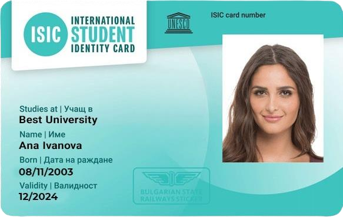

## Студентска карта

ISIC (International Student Identity Card) е международен документ с безплатно издаване, който предоставя множество намаления за пътуване, пазаруване, обучение, спорт, хранене, достъп до библиотека, общежития и столове.
[Информация за издаване и за предоставяните намаления можете да намерите тук](https://isic.bg)

